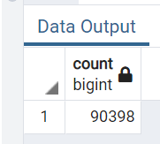
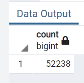
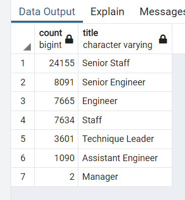
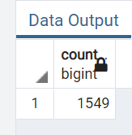

# Pewlett-Hackard Analysis with SQL

## Overview of Company Data 
The purpose of this analysis is to help a company determine how many
employees will be retiring soon. A handful of employee information was
used to determine which employees would be eligible for retirement. 
Employee birthdates were used to capture all employees whose birthdate
fell into a certain date range. Then from those employees a table was created
to capture the number of employees retiring from each department and still
employeed at the company. After gathering this data, it was then used to 
determine which of the employees retiring will be eligible for the 
new mentorship program. 

## Results
- At first glance, close to 100,000 employees are set to retire; however looking more closely
a little over half of those employees are no longer with the company, dropping the number of 
employees set to retire drastically

- With that being said, still a whopping 50,000+ employees will be retiring from the 
company soon

- Over half of the employees retiring are Senior Staff and or Engineers

- Roughly, only about 1,500 employees are eligible for the Mentorhip Program

## Pewlett-Hackard Analysis Summary
1. How many roles will need to be filled as the "silver tsunami" begins to make an impact?
  About 50,000 roles will need to be filled 
2. Are there enough qualified, retirement-ready employees in the departments to mentor the 
 next generation of Pewlett Hackard employees?
  Given that roughly 1,500 retirees are qualified for the mentorship program and not all 
  positions must be filled at once, YES Pewlett-Hackard has enough retirement-ready
  employees to mentor the next generation. However, the data does depict there is 
  significantly more Senior Staff retiting than any other department. Therefore, the
  ratio of employees eligible for the program does not match the demand for incoming
  number of Senior Staff. On the other hand, if the company is looking to promote internally
  this tranisition can be much more manageable. Depending on how the company would like to
  tackle this issue effects the answer to this question. But, at a glance this is very doable
  with the number of employees retiring.
